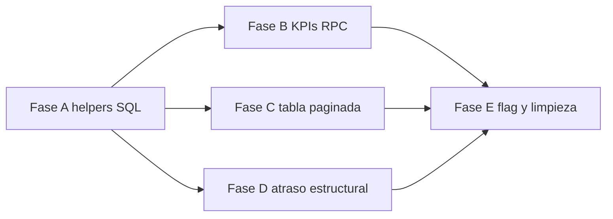

# Plan — Reportes de cartera calculados en Supabase

Documento de implementación para mover agregaciones y paginación del reporte desde el navegador (`reportesApi.js`) a **PostgreSQL (Supabase)**, respetando **RLS** y el contrato JSON que consume `ReportePage.jsx`.

Complementa [`analisis-proyecto.md`](analisis-proyecto.md) y [`reglas-negocio.md`](reglas-negocio.md).

---

## 1. Objetivo

| Hoy | Objetivo |
|-----|----------|
| PostgREST trae hasta **20 000** filas | La BD filtra, agrega y pagina |
| KPIs, matrices y orden en **JavaScript** | **`rpc()`** en PostgreSQL |
| Tabla recortada a **5 000** filas en cliente | Tabla con **página + total** desde SQL |
| Segunda query de composición (20k) para atraso estructural | Una sola fuente filtrada o RPC dedicada |

**Resultado:** menos datos en red, KPIs sobre el universo completo filtrado, mejor rendimiento en móvil y carteras grandes.

---

## 2. Situación actual (referencia)

```
ReportePage.jsx
    └── fetchCarteraReporte()  →  reportesApi.js
            ├── supabase.from('notas_credito').limit(20000)
            ├── supabase.from('aclaraciones') por chunks (tiene_comentarios)
            ├── bucketMatch / sort / KPIs / porRuta / pivot  (JS)
            ├── fetchComposicionRowsSupabase().limit(20000)
            └── buildAtrasoEstructuralPayload()  (JS, shared utils)
```

Archivos clave:

| Archivo | Rol |
|---------|-----|
| `frontend/src/services/reportesApi.js` | Lógica a sustituir por RPC |
| `frontend/src/pages/reporte/ReportePage.jsx` | UI; añadir controles de página |
| `frontend/src/utils/atrasoEstructural.js` | Mantener en JS **o** replicar reglas en SQL (fase 4) |
| `api/src/routes/reportesRoutes.js` | Legacy (`API_LEGACY_ROUTES`); no extender |

---

## 3. Principios de diseño

1. **`SECURITY INVOKER`** en todas las funciones RPC → RLS de `notas_credito` aplica igual que PostgREST directo.
2. **Contrato JSON estable** → la forma de `response` en `reportesApi.js` no cambia (minimizar diff en `ReportePage.jsx`).
3. **Filtros comunes en un CTE reutilizable** → una sola definición de “universo del reporte”.
4. **Migración incremental** → flag `VITE_REPORTES_RPC=true` para alternar JS vs RPC hasta validar en producción.
5. **Sin bypass service_role** desde el front → solo JWT del usuario autenticado.

---

## 4. Modelo SQL compartido

### 4.1 Expresiones canónicas (igual que JS hoy)

```sql
-- Días desde fecha_nota (equivalente a diasFromFechaNota en reportesApi.js)
CREATE OR REPLACE FUNCTION public.reporte_dias_nota(p_fecha date)
RETURNS integer
LANGUAGE sql
IMMUTABLE
AS $$
  SELECT CASE
    WHEN p_fecha IS NULL THEN NULL
    ELSE (CURRENT_DATE - p_fecha)::integer
  END;
$$;

-- Bucket UI (r1…r6) — equivalente a bucketMatch()
-- p_bucket: 'all' | 'r1' | 'r2' | 'r2b' | 'r3' | 'r4' | 'r5' | 'r6'
CREATE OR REPLACE FUNCTION public.reporte_match_dias_bucket(p_dias integer, p_bucket text)
RETURNS boolean
LANGUAGE sql
IMMUTABLE
AS $$
  SELECT CASE lower(trim(p_bucket))
    WHEN 'all' THEN true
    WHEN 'r1' THEN p_dias IS NOT NULL AND p_dias >= 0 AND p_dias <= 30
    WHEN 'r2' THEN p_dias IS NOT NULL AND p_dias > 30 AND p_dias <= 45
    WHEN 'r2b' THEN p_dias IS NOT NULL AND p_dias > 45 AND p_dias <= 60
    WHEN 'r3' THEN p_dias IS NOT NULL AND p_dias > 60 AND p_dias <= 90
    WHEN 'r4' THEN p_dias IS NOT NULL AND p_dias > 90 AND p_dias <= 180
    WHEN 'r5' THEN p_dias IS NOT NULL AND p_dias > 180 AND p_dias <= 365
    WHEN 'r6' THEN p_dias IS NOT NULL AND p_dias > 365
    ELSE true
  END;
$$;

-- Bucket agregación (negativo, d0_30, …) — equivalente a bucketIdFromDias()
CREATE OR REPLACE FUNCTION public.reporte_bucket_id(p_dias integer)
RETURNS text
LANGUAGE sql
IMMUTABLE
AS $$
  SELECT CASE
    WHEN p_dias IS NULL OR p_dias < 0 THEN 'negativo'
    WHEN p_dias <= 30 THEN 'd0_30'
    WHEN p_dias <= 45 THEN 'd31_45'
    WHEN p_dias <= 60 THEN 'd46_60'
    WHEN p_dias <= 90 THEN 'd61_90'
    WHEN p_dias <= 180 THEN 'd91_180'
    WHEN p_dias <= 365 THEN 'd181_365'
    ELSE 'd366_plus'
  END;
$$;
```

### 4.2 CTE base (filtros SQL actuales)

Parámetros comunes a todas las RPC:

| Parámetro | Tipo | Notas |
|-----------|------|-------|
| `p_empresa` | text | `DISTRIBUIDORA` \| `RODRIGO` |
| `p_estado` | text | `PENDIENTE` (default), `RESUELTA`, `CANCELADA`, `TODOS` |
| `p_dias_bucket` | text | `all`, `r1`…`r6` |
| `p_q` | text | Búsqueda ILIKE cliente / folio / PV |
| `p_fecha_desde` | date | nullable |
| `p_fecha_hasta` | date | nullable |
| `p_ruta_codigos` | text[] | nullable; códigos en mayúsculas |

CTE conceptual:

```sql
WITH base AS (
  SELECT
    n.*,
    r.codigo AS ruta_codigo,
    u.username AS vendedor_username,
    public.reporte_dias_nota(n.fecha_nota) AS dias,
    EXISTS (SELECT 1 FROM public.aclaraciones a WHERE a.nota_id = n.id) AS tiene_comentarios
  FROM public.notas_credito n
  LEFT JOIN public.rutas r ON r.id = n.ruta_id
  LEFT JOIN public.usuarios u ON u.id = n.usuario_id
  WHERE n.empresa = p_empresa
    AND (p_estado = 'TODOS' OR n.estado = p_estado)
    AND (p_ruta_codigos IS NULL OR r.codigo = ANY(p_ruta_codigos))
    AND (p_fecha_desde IS NULL OR n.fecha_nota >= p_fecha_desde)
    AND (p_fecha_hasta IS NULL OR n.fecha_nota <= p_fecha_hasta)
    AND (
      p_q IS NULL OR trim(p_q) = ''
      OR n.cliente ILIKE '%' || p_q || '%'
      OR n.serie_folio ILIKE '%' || p_q || '%'
      OR n.usuario_vendedor_pv ILIKE '%' || p_q || '%'
    )
),
filtered AS (
  SELECT * FROM base b
  WHERE public.reporte_match_dias_bucket(b.dias, p_dias_bucket)
)
```

> **RLS:** al leer `notas_credito` con el rol del usuario invocador, las políticas existentes filtran filas (vendedor solo sus rutas).

---

## 5. Fases de implementación

### Fase A — Fundamentos SQL (1–2 días)

| # | Entregable | Criterio de hecho |
|---|------------|-------------------|
| A.1 | Migración `supabase/migrations/YYYYMMDD_reporte_helpers.sql` | Funciones `reporte_dias_nota`, `reporte_match_dias_bucket`, `reporte_bucket_id` |
| A.2 | Índice compuesto si falta en prod | `(empresa, estado, fecha_nota)` — verificar con `verificar-configuracion-bd.sql` |
| A.3 | Script manual `supabase/scripts/reporte-rpc-smoke.sql` | Query de prueba con filtros fijos; resultado comparable a pantalla actual |
| A.4 | Documentar secrets/permisos | `GRANT EXECUTE ON FUNCTION … TO authenticated` |

**No tocar frontend aún.**

---

### Fase B — KPIs y agregados en RPC (2–3 días)

| # | Entregable | Criterio de hecho |
|---|------------|-------------------|
| B.1 | `reporte_cartera_kpis(p_empresa, p_estado, p_dias_bucket, p_q, p_fecha_desde, p_fecha_hasta, p_ruta_codigos)` → `jsonb` | Devuelve objeto `kpis` idéntico al JS (registros, saldo_total, dias_promedio, …) |
| B.2 | `reporte_cartera_agregados(…mismos params…)` → `jsonb` | Devuelve `{ porRuta, porAntiguedad, porCliente, porSituacion, resumenPivot }` |
| B.3 | Lógica `porSituacion` en SQL | Mismos 8 `situacion_id` que `buildPorSituacion()` |
| B.4 | `porCliente` limitado a top 15 por saldo | Igual que `.slice(0, 15)` |
| B.5 | Test SQL o script comparativo | KPIs RPC vs export JSON del front (misma empresa/filtros) ± tolerancia redondeo |

**Frontend:** `reportesApi.js` llama RPC para KPIs/agregados; **sigue** trayendo filas en JS hasta Fase C.

---

### Fase C — Tabla paginada (2–3 días)

| # | Entregable | Criterio de hecho |
|---|------------|-------------------|
| C.1 | `reporte_cartera_filas(…, p_sort, p_page, p_page_size)` → `jsonb` | `{ items, total, page, page_size, total_pages }` |
| C.2 | Orden SQL para cada `sort` | `saldo_desc`, `saldo_asc`, `dias_desc`, `dias_asc`, `fecha_desc`, `fecha_asc`, `cliente_asc`, `folio_asc` |
| C.3 | `reportesApi.js` — eliminar `.limit(20000)` y loops de aclaraciones | Una RPC o join en SQL para `tiene_comentarios` |
| C.4 | `ReportePage.jsx` — paginación UI | Botones anterior/siguiente + “Página X de Y”; quitar banner `truncated` basado en 5k |
| C.5 | `page_size` default 100, max 500 | Configurable; export Excel usa paginación o RPC sin límite con rol CREDITO |

**Eliminar:** `MAX_ROWS = 5000` como tope duro; `total` viene de `COUNT(*)` en SQL.

---

### Fase D — Atraso estructural (1–2 días)

| # | Entregable | Criterio de hecho |
|---|------------|-------------------|
| D.1 | `reporte_atraso_estructural(p_empresa, p_q, p_fecha_desde, p_fecha_hasta, p_ruta_codigos)` | Misma forma que `buildAtrasoEstructuralPayload()` |
| D.2 | Leer umbral desde `parametros.clave = 'cobranza_umbral_atraso_pct'` en SQL | Default 50 si ausente |
| D.3 | Integrar en respuesta unificada o segunda RPC | `fetchCarteraReporte` compone `atrasoEstructural` + KPIs derivados |
| D.4 | Eliminar `fetchComposicionRowsSupabase` y segundo `.limit(20000)` | |

**Opción:** mantener `atrasoEstructural.js` solo para tests unitarios; producción 100% SQL.

---

### Fase E — Integración, flag y limpieza (1–2 días)

| # | Entregable | Criterio de hecho |
|---|------------|-------------------|
| E.1 | `VITE_REPORTES_RPC=true` en `.env.example` | Fallback a JS si `false` (rollback rápido) |
| E.2 | `fetchCarteraReporteSupabaseRpc()` en `reportesApi.js` | Contrato JSON igual; tests de forma |
| E.3 | Tests Vitest con mocks de `supabase.rpc` | Al menos KPIs + paginación |
| E.4 | Checklist manual [`checklist-pruebas-manuales.md`](checklist-pruebas-manuales.md) | Casos: DISTRIBUIDORA/RODRIGO, buckets, vendedor vs crédito |
| E.5 | Borrar código JS muerto | Agregaciones, `limit(20000)`, `truncated` legacy |
| E.6 | Actualizar `analisis-proyecto.md` | Marcar paginación reportes como hecho |

---

## 6. Contrato RPC unificado (opcional, fase E)

Alternativa a 3 RPC separadas — **una sola llamada**:

```sql
CREATE OR REPLACE FUNCTION public.reporte_cartera(
  p_empresa text,
  p_estado text DEFAULT 'PENDIENTE',
  p_dias_bucket text DEFAULT 'all',
  p_q text DEFAULT NULL,
  p_fecha_desde date DEFAULT NULL,
  p_fecha_hasta date DEFAULT NULL,
  p_ruta_codigos text[] DEFAULT NULL,
  p_sort text DEFAULT 'saldo_desc',
  p_page integer DEFAULT 1,
  p_page_size integer DEFAULT 100
)
RETURNS jsonb
LANGUAGE plpgsql
SECURITY INVOKER
SET search_path = public
AS $$ … $$;
```

Retorno: mismo objeto que hoy devuelve `fetchCarteraReporteSupabase` (sin `debug` salvo param `p_debug`).

**Ventaja:** un round-trip. **Desventaja:** payload grande; preferible RPC separadas si solo cambian filtros de tabla.

---

## 7. Cambios en frontend (resumen)

| Componente | Cambio |
|------------|--------|
| `reportesApi.js` | `supabase.rpc('reporte_cartera_kpis', { … })` etc.; sin agregaciones locales |
| `ReportePage.jsx` | Estado `page`, `pageSize`; recargar al cambiar filtros (reset page=1) |
| `listFiltersStore` / localStorage | Persistir página opcional o resetear a 1 al cambiar filtros |
| Export / impresión | Iterar páginas o RPC `p_page_size` alto solo para export (rol CREDITO) |

---

## 8. Seguridad y RLS

| Verificación | Cómo |
|--------------|------|
| Vendedor no ve notas ajenas | Login como VENDEDOR; KPIs `registros` ≤ notas de sus rutas |
| CREDITO ve todo | Comparar totales con admin |
| Funciones no elevan privilegios | `SECURITY INVOKER`, no `DEFINER` salvo justificación |
| Grants | Solo `authenticated`; no `anon` |

Prueba post-deploy: ejecutar V.11 + checklist por rol.

---

## 9. Criterios de aceptación globales

- [ ] Cartera con **>20 000** pendientes: KPIs correctos (antes incompletos).
- [ ] Tabla navegable por páginas sin cargar 20k filas al navegador.
- [ ] Tiempo de carga inicial reporte **< 3 s** en cartera mediana (medir en DevTools).
- [ ] Paridad numérica con versión JS en muestra de 10 filtros aleatorios (±0.01 en montos).
- [ ] Vendedor / CREDITO / ADMIN: mismos límites RLS que seguimiento.
- [ ] CI: tests API o front verdes; migración aplicada en Supabase prod.

---

## 10. Riesgos y mitigación

| Riesgo | Mitigación |
|--------|------------|
| Divergencia JS vs SQL en buckets | Funciones SQL copiadas de tests existentes; script comparativo |
| RPC lenta sin índices | Fase A.2; `EXPLAIN ANALYZE` en smoke script |
| Rollback urgente | `VITE_REPORTES_RPC=false` |
| Atraso estructural complejo | Fase D separada; no bloquea C |
| Duplicar lógica API legacy | No tocar `reportesRoutes.js` |

---

## 11. Estimación total

| Fase | Esfuerzo | Dependencias |
|------|----------|--------------|
| A Fundamentos | 1–2 d | — |
| B KPIs + agregados | 2–3 d | A |
| C Paginación tabla | 2–3 d | A, B |
| D Atraso estructural | 1–2 d | A |
| E Integración y limpieza | 1–2 d | B, C, D |

**Total: ~8–12 días** de desarrollo + 1 día QA manual por rol.

---

## 12. Orden recomendado de trabajo



**Primer PR sugerido:** Fase A + B (KPIs en SQL, front aún no pagina).  
**Segundo PR:** Fase C (paginación visible).  
**Tercer PR:** Fase D + E.

---

## 13. Referencias

| Tema | Ubicación |
|------|-----------|
| Lógica actual JS | `frontend/src/services/reportesApi.js` |
| UI reporte | `frontend/src/pages/reporte/ReportePage.jsx` |
| Atraso estructural | `frontend/src/utils/atrasoEstructural.js` |
| RLS notas | `supabase/scripts/aplicar-rls-completo.sql` |
| Verificación BD | `supabase/scripts/verificar-configuracion-bd.sql` |

---

*Actualizar este plan al cerrar cada fase (marcar entregables y fecha).*
